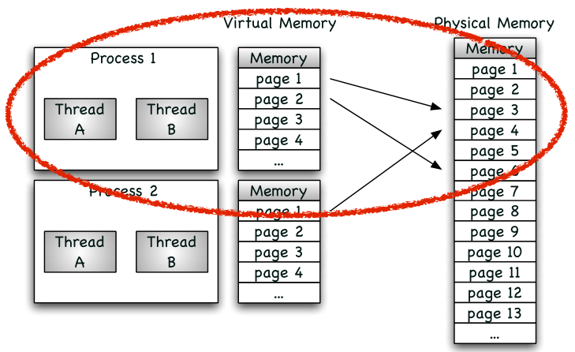

### Christian Zhuang-Qing Nielsen, 201504624 
# **ISU 1: Programs in relation to the OS and Kernel**
- [**ISU 1: Programs in relation to the OS and Kernel**](#isu-1-programs-in-relation-to-the-os-and-kernel)
    - [**Processes and Threads**](#processes-and-threads)
        - [**Operativsystem**](#operativsystem)
        - [**Processer**](#processer)
        - [**Tråde**](#tråde)
        - [**Threading Model**](#threading-model)
    - [**Virtual Memory**](#virtual-memory)
    - [**Threads being executed on CPU, the associated scheduler & Cache**](#threads-being-executed-on-cpu-the-associated-scheduler--cache)
## **Processes and Threads**
### **Operativsystem**
Et operativsystem er det software som håndterer computerens hardware og ressourcer, og danner et fundament for applikationer der skal køre på maskinen således at applikationerne kan kommunikere med hardwaren effektivt og sikkert.

Et operativsystem håndterer en lang række ting. Disse er bl.a.: Processer, hukommelse, lagring og input/output delsystemet. Operativsystemer kan være designet vidt forskelligt afhængigt af deres formål. F.eks. skal OS i embedded devices tilfredsstille kravene. Ved computeren i en bilmotor skal den være hurtigt, effektiv og være meget pålidelig/sikker, så der ikke lige pludselig sker noget farligt mht. bilen. Derimod skal operativsystemet i en personlig computer være optimeret mod generalitet, således de kan benyttes til så mange opgaver som muligt.

### **Processer**
En proces er et program i kørsel. Der kan være mange processer som gerne vil køre på computeren, men kun én proces kan få CPU-tid ad gangen. Operativsystemet håndterer processerne i form af at:
- Skabe, slette og allokere ressourcer til dem.
- Skifte dem ind- og ud af den fysiske hukommelse.
- Pause og genstarte dem
- Håndtere kommunikation og synkronisering mellem forskellige processer.

**Process Management/Scheduling:** Enten beregner processer noget, eller også udfører de enhedsinput/-output. Hvis der ikke var proceshåndtering (scheduling), så ville CPU'en sidde og trille tommelfingre mens en proces ventede på I/O. Heldigvis med scheduling kan den skifte til en anden klar proces. En kontekst er miljøet af den nuværende proces. Når man skifter til en ny proces kaldes det for et **_kontekstskift_**

**Sikkerhed:** Ved hjælp af operativsystemet, kan vi sikre os at ondsindede processer ikke får lov til at ødelægge computeren (ved at ødelægge filer, software og hardware) eller ved at udføre ondsindede ting mod andre processer. Dette gør den ved at adskille applikationer fra OS kernelen. Kernel kommer da til at køre i den privilegerede **_kernel mode_**, mens applikationer kommer til at køre i den begrænsede **_user mode_**. Kernel kan fra kernel mode tilgå processer og hukommelse i user mode, hvorimod det omvendte ikke gælder. Alle "farlige" handlinger kan kun ske igennem kernel mode, så en applikation kan kun udføre disse ondsindede handler hvis den gør det igennem kald til OS Kernel, hvilket den nok ikke gør.

For at en applikation kan tilgå ting som kernelen håndterer (som f.eks. input/output), så bliver den nødt til at lave kald til OS i kernel mode, som så kan udføre disse kald (på en sikker måde). Dette gøres ved de såkaldte **_systemkald_**.

**Proces-anatomi:**
Hver proces har en virtuel hukommelse på pointeres adressestørrelse. Denne størrelse er omkring 4 GB i et 32-bit system. Her for processen lov til at gøre lige hvad den vil, for den tror at den har adgang til hele hukommelsen selv. Det som i virkeligheden sker er, at operativsystemet mapper processens virtuelle hukommelsesadresser til den fysiske hukommelse via **_page tables_**. OS kernel har sin egen hukommelse (kernel space), og eftersom hver proces har en "kopi" af den samme virtuelle "sandbox", så bliver hver sandbox også nødt til at inkludere det reserverede hukommelse til kernelen. Hvis en proces prøver at tilgå den privilegerede hukommelse får den en page-fault fejl.

I hver applikations adressesæt er der en LIFO **stack** med funktionparametre og returværdier samt andre lokale variable. Den vokser oppefra og ned. Der er også en **heap** der vokser nedefra og op. Denne heap bruges til dynamisk allokeret hukommelse. Til sidst er der plads til fil-mappings, andre variabler, delt hukommelse mellem processer, osv.

### **Tråde**
En tråd er en kørsel af en sekvens af instruktioner som uafhængigt kan blive håndteret af en scheduler. Implementeringen af tråde og processer varierer afhænger af operativsystemdesignet, men i de fleste tilfælde er en tråd en komponent af en proces. 

En proces kan have flere tråde, og de kan køre sideløbende. De deler hukommelse og kan derfor også påvirke hinandens data uden systemkald.

Som set på billedet er det to processer. De har hver to tråde. Disse to processer har deres egne sæt memory-adresser (1,2,3,4,...). Disse bliver mappet af OS's **_Memory Management Unit_ (MMU)** til den fysiske hukommelse. Da trådene deler hukommelse skal man være forsigtig at de ikke ødelægger hinandens data ved en fejl. MMU'en indeholder også alle referencerne mellem processernes virtuelle hukommelse og den fysiske hukommelse. CPU'en indeholder ofte også en **_Translation Lookaside Buffer_ (TLB)**, der er en cache som bruges til hurtigere at finde denne mapping på de seneste aktive processer.

**Fordele og Ulemper:** Fordele ved at multithreade er at man kan prioritere opgaver, således at dem med højst prioritet for lov til at komme først. Det gør det muligt at udføre flere opgaver på samme tid, ved at koordinere sine ressourcer så CPU'en ikke kommer til at idle.

Ulemper er de problemer der kan opstå ved at køre threads sideløbende (ukendte værdier på et givent tidspunkt, deadlock, starvation, osv.)

### **Threading Model**
Der er tre forskellige modeller inden for threading:

1. *User-level threading*
2. Kernel-level threading
3. Hybrid-level threading

**User-level threading:** I user-level threading betyder det at alle application-level tråde er mappet til én enkelt kernel-level tråd. Man kan lynhurtigt kontekstskifte mellem tråde, eftersom der ikke er brug for systemkald. Det er en super simpel implementering, men man kan ikke bruge hardware acceleration eller flere af CPU'ens kerner på denne måde, da kernelen ikke kan "se" trådene.

**Kernel-level threading:** I kernel-level threading forbinder man user-level tråde med kernel-level tråde i en _en-til-en_ mapping. Dette gør det muligt at køre adskillige tråde i parallel. Dette betyder dog at hvis en user application skal lave en ny tråd, så skal der også skabes en ny kernel-tråd, hvilket giver en stor mængde overhead og dermed dårlig performance. Her er der også brug for at kernelen skal have "thread awareness".

**Hybrid-level threading:** Dette er et kompromis mellem de to ovenstående modeller. I denne model bliver et antal user-level tråde associeret til en højst lige så stor mængde kernel-level tråde. Dette er en kompleks implementering da man skal ændre kode i både kernel- og user space. Den benytter sig ikke af system calls til context switching, men man kan stadig skabe nye user-threads uden nødvendigvis at starte flere kernel-threads.

## **Virtual Memory**
Den primære hukommelse (CPU-cache og RAM) er aldrig stor nok til at kunne lagre alle tingene på computeren, derfor bruger man sekundær lagring (SSD/HDD) til at lagre de ting man ikke skal være i den nærmeste fremtid. OS udfører hukommelseshåndtering ved at holde styr på de forskellige processer i den primære hukommelse ad gangen, og bestemmer når de skal flyttes ud til den sekundære lagring. Hukommelsen allokeres efter behov.
## **Threads being executed on CPU, the associated scheduler & Cache**
Se de andre punkter. Antager at dette punkt har med context switching og MMU/TLB at gøre, hvilket er beskrevet under processer og tråde.
