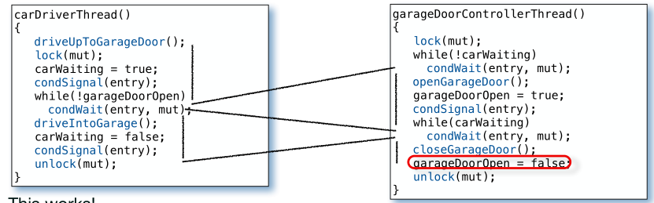
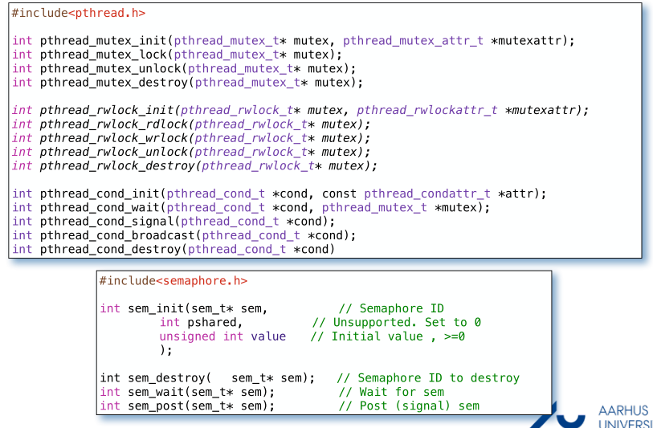

### Christian Zhuang-Qing Nielsen, 201504624
# **ISU 2: Synchronization and Protection**
- [**ISU 2: Synchronization and Protection**](#isu-2-synchronization-and-protection)
    - [**Data integrity - Concurrency Challenge**](#data-integrity---concurrency-challenge)
    - [**Mutex & Semaphore**](#mutex--semaphore)
        - [**Queues**](#queues)
    - [**Producer / Consumer Problem**](#producer--consumer-problem)
    - [**Mutex & Conditionals**](#mutex--conditionals)
    - [**Andet**](#andet)
    - [**Deadlocks**](#deadlocks)
        - [**Dining Philosophers**](#dining-philosophers)
## **Data integrity - Concurrency Challenge**
Når data er delt mellem flere tråde, så kan vi ikke være sikre på dataens værdi når begge tråde har muligheden for at ændre på dataen på samme tid. Vi ønsker derfor metoder der hjælper os med kun at én tråd adgang til den fælles data ad gangen. Vi vil altså gerne have at den **delte** data skal være **_mutually exclusive_**.
## **Mutex & Semaphore**
En **mutex** løsning på ovenstående problem. En mutex er et **mut**ually **ex**clusive flag/variabel, hvorpå man kan udføre to metoder:
**lock(mut_)** og **unlock(mut_)**. Når en tråd udfører lock()-metoden, tjekker den om variablen er ledig, hvis ikke så blocker tråden, indtil den kan få adgang. unlock()-metoden frigiver mutexen fra den nuværende tråd. Det er kun den som succesfuldt har udført lock(), som kan unlock().

En mutex variabel erklæres og initialiseres med: `Mutex mut_ = MUTEX_INITIALIZER;`, hvilket er en makro. Den kan også initialiseres med `pthread_mutex_init();`, såfremt man benytter sig af pthreads.

**Semaphore** er også en løsning på problemet med den delte variabel. En semaphore kan dog lade mere en én tråd udføre arbejde på critial section ad gangen, afhængig af hvordan den er initialiseret. Semaphore har to metoder: `take(sem_)` og `release(sem_)`. Den erklæres og initialiseres således `SEM_ID sem_ = createSem(i)`, hvor `i` er et heltal > 0. Når take bliver kaldt, trækkes 1 fra `sem_`. Hvis `sem_`= 0 når `take()` bliver kaldt, så blocker tråden. Når `release()` bliver kaldt, så lægges der 1 til `sem_`.

### **Queues**
Når en tråd ikke kan få adgang og blocker, så bliver den lagt i en FIFO kø af blockende tråde. Alternativt kan man give trådene prioritets-baseret rækkefølge i køen. Dette sker både for mutexi og semaphores.

## **Producer / Consumer Problem**
Producer/Consumer problemet er et klassisk eksempel på et multi-threaded synkroniseringsproblem. Den kaldes også for **bounded-buffer problemet**. Den består hhv. af en _Producer_, en _Consumer_ og en _buffer_ der fungerer som en kø. Produceren lægger data ind i køen og consumeren tager data ud af køen. Målet er at koordinere producer og consumer, således at de de ikke lægger ting i køen når den er fuld, eller tager ting ud af køen når den er tom.

Løsningen til dette problem er at benytte sig af 2 counting semaphores (initialiseres `createCountingSem(size)`). Når produceren skal lægge noget i køen, tager den først den ene semaphore, som beskriver antallet af tomme pladser tilbage i køen. Hvis denner er nul blocker den indtil consumeren har taget noget ud af køen, hvorefter producer bliver notified. Efter produceren har lagt noget ind i køen, releaser den _den anden_ semaphore, som beskriver hvor mange pladser der er brugt i køen. Dette tæller semaphoren op.  
Omvendt starter consumeren med at tage semaphoren der beskriver antallet af bruge pladser. Hvis denne er tom (dvs. køen er tom), så blocker den indtil produceren har lagt noget i køen. Når consumeren har taget noget ud af køen releaser den semaphoren der beskriver antallet af tomme pladser i køen ved at tælle den én op.

En perspektivering til dette problem er **parkeringsproblemet**, hvor det er biler der gerne vil ind, og en dør der kun skal åbne hvis der er plads.
## **Mutex & Conditionals**
For at kunne løse parkeringsproblemet, så skal vi have et form for signaleringssystem, der fortæller garagen, at der er en bil, som venter på at køre indenfor. Til dette formål kan vi benytte os af `pthread_conditionals`, som er en implementering af conditional variables (CV). Det smarte ved CV er at man kan **_vente_** på en given CV, og at man kan **_signalere_** til tråde der venter på en given CV.

I parkeringsproblemet kan løses ved at bruge mutexes og conditionals. Når en bil kører op, tager den låsen for en mutex, og så signalerer den at den venter (dvs. sætter en boolean til  TRUE), hvorefter den signalerer de threads der venter på den conditional variable der styrer indgangen til garagen. Samtidig med dette sker er garagedørens controller i gang med at vente på at der kommer en bil. Vi vil ikke have at den hele tiden poller om der er en bil, så vi lader den vente indtil den bliver notified på garagedørens CV. Hele løsningen kan ses i billedet herunder:

Mutex, semaphores og conditional metoder:

## **Andet**
**Monitor template class:** Én klasse sørger for at ordne alle tingene som kræver critical section. De tråde der vil tilgå shared data requester så en handling gennem denne klasse.

**Scoped Locking idiom:** Dette idiom handler om, at man skal udføre korrekt oprydning (inkl fejlhåndtering). Idéen er at et objekt selv tager og frigiver en mutex på de korrekte tidspunktor, dette kunne f.eks. være i constructoren og destructoren, hvilket gør rent i hele objektets scope.

## **Deadlocks**
En deadlock er en situation, hvor to eller flere tråde venter på at de skal frigive hinandens ressourcer, hvilket betyder at de kommer til at vente for evigt. Der kan opstå en deadlock _hvis og kun hvis_ de fire følgende krav er opfyldt:

1. **Mutual exclusion:** Ressourcen kan kun holdes af én tråd af gangen.
2. **Hold-and-wait:** En proces, der allerede har mindst én ressource kan forsøge at tilgå flere ressourcer / tage flere låse.
3. **No preemption:** Man kan ikke tvinge en tråd til at frigive en ressource.
4. **Circular wait cocndition:** At der findes en cykel p_0, p_1, ... p_n, hvor en given proces venter på den næste proces p_i+1 frigiver sin ressource. Dette sker i en cykel.

### **Dining Philosophers**
Dining philophers problemet er et meget kendt eksempel på et deadlock problem. Det beskriver fire filosoffer der sidder ved et rundt bor hvor der kun er fire gafler. Det er filosoffernes mål på skift at:
1. Samle den ene gaffel op.
2. Samle den anden gaffel op.
3. Spise mad.
4. Lægge gafler ned ned.
5. Sætte sig til at tænke.

Problemet her er da, at filosofferne kun kan spise hvis de har begge gafler, men hvis alle tager gaflen på den samme side (alle på højre eller alle på venstre), så ender de med aldrig at kunne samle den anden gaffel op, og de ender i en deadlock.

**Løsningen:** Dette problem kan løses ved at bryde én af de fire deadlock krav beskrevet i starten. Vi kan ikke:
1. Fjerne mutual exclusion, da to personer ikke kan bruge den samme gaffel på samme tid.
2. Fjerne hold-and-wait, hvilket betyder at filosofferne kun kan have én gaffel ad gangen, men det går slet ikke!
3. Tage gaflen ud af en anden filosofs hånd. Filosoffer er gentlemen.

Det vi dog kan gøre er at:
- Bryde den cykel der gør at den cykel der eksisterer. :-)

Hvis to af filosofferne (dem der sidder over for hinanden), starter med at tage deres højre gaffel, så vil bliver cirklen brudt og de ender alle sammen med at få spist.
