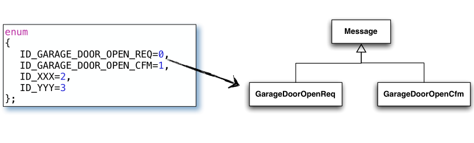

### Christian Zhuang-Qing Nielsen, 201504624
# **ISU 3: Thread Communication**
- [**ISU 3: Thread Communication**](#isu-3-thread-communication)
    - [**The Challenges performing intra-process communication**](#the-challenges-performing-intra-process-communication)
    - [**Event Driven Programming (EDP)**](#event-driven-programming-edp)
        - [**Basic idea**](#basic-idea)
        - [**Reactiveness**](#reactiveness)
        - [**Design (e.g. from sequence diagrams to code or vice versa)**](#design-eg-from-sequence-diagrams-to-code-or-vice-versa)
    - [**Message queue (MQ)**](#message-queue-mq)
        - [**The premises for designing it**](#the-premises-for-designing-it)
        - [**Various design solutions- Which one chosen and why**](#various-design-solutions--which-one-chosen-and-why)
        - [**Its design and implementation**](#its-design-and-implementation)
    - [**Impact on design/implementation between before and after the Message Queue**](#impact-on-designimplementation-between-before-and-after-the-message-queue)
## **The Challenges performing intra-process communication**
Vi bliver nødt til at sikre os at tråde ikke ødelægger hinandens data uhensigtsmæssigt. Vi bruger mutexes, semaphores og conditional variables (CV) til dette. Med CV'er kan individuelle tråde vente på at forholdene bliver korrekte, hvorefter de bliver notified (hvilket sparer en del cpu-tid). De bruger mutexes og semaphorer som "låseenheder", der sikrer at uvedkommende ikke har adgang mens tråden er i sin critical section. Dette kan foregå adskillige gange i bare ét iterationsloop.  
Ud over dette hænder det ofte også at tråde skal bruge flere delte ressourcer, så her skal man også tage i betragtning hvilken rækkefølge ressourcerne skal anskaffes på.

**Konsekvensen** af de ovenstående valg og pricipper er at vi opnår et design hvor der ikke er deadlock- eller timing issues. Vi skal være forsigtige at kodens læsbarhed ikke bliver alt for ringe (hvilket nemt kan ske når der er en masse concurrency-fyldekode).

**Det vi har brug for er:** 
- Et design hvor _alle processer_ inden for en tråd **ikke** benytter sig af låse. 
- At bevare funktionaliteten med at andre tråde kan passere kontrol og/eller data rundt til en specifik tråd via en eller anden mekanisme. 
- At adskillige tråde samtidigt kan passere kontrol og/eller data uden problemer. 

**Løsningen:**
Event driven programming. Vi vil gerne udføre en handling når en eller anden forudsætning bliver sand eller vi bliver signaleret/notified.
## **Event Driven Programming (EDP)**
### **Basic idea**
Konceptet bag EDP er at vi udfører vorers handlinger ud fra events der sker. Eksempler på dette kan f.eks. være grafiske interfaces (når brugeren klikker på noget), Javascript på hjemmesider samt drivers der skal reagere ved input/probing.
### **Reactiveness**
For at kunne reagere kører der ofte et uendeligt loop der holder øje med events. Hvis vi snakker om beskeder ligesom i afleveringen så må disse kunne bearbejdes af en specifik **handler**, som reagerer når den får en besked tilsendt, og hånterer denne besked på baggrund af hvad programmøren har valgt. Hvis vi har en termostat, så får handler at vide at der er sket et event, og det er så op til handleren at videregive hvad vi skal gøre. Hvis eventet var et "der er for koldt"-event, så vil handleren nok switche til kode der lukker op for ventilen og dermed gør det varmere. Ligeledes med hvis der var for varmt.
### **Design (e.g. from sequence diagrams to code or vice versa)**
I tilfælde hvor man skal koordinere arbejde fra forskellige tråde er det _altid_ til fordel at lave et **_sequence diagram_** der viser kommunikationsflowet i processen. Man kan også med fordel lave et **_state transition diagram_**, der viser hvilke tilstande programmet kan være i, for at forbygge mod uventede errors.

Hvis vi antager at events kan beskrives som meddelelser ligesom i afleveringen, så vil designet af vores EDP-program kunne ses som en to-faset proces:

1. **Modtag nye beskeder:** I denne fase modtager man nye beskeder. Dette håndteres af en **_Message Queue_**, som sikrer at antallet af beskeder kan blive lagt i kø (således at vi kan danne en FIFO/priority/osv. rækkefølge i meddelelserne).
2. **Bearbejd nye beskeder i handler:** I denne fase tjekker handleren hvilken type besked/event vi har modtaget, og den udfører en specifik handling afhængig af den specifikke meddelelse.

## **Message queue (MQ)**
Vores message queue minder lidt om producer/consumer-problemet. I dette tilfælde er det højst sandsynligt adskillige producers der producerer forskellige meddelelser til vores consumer. Vi vil gerne lægge disse meddelelser i en form for kø og tage dem ud én efter og udføre en eller anden handling ud fra meddelelsens indhold. 
### **The premises for designing it**
Før vi kan begynde at designe en MQ, så er der nogle krav vi bliver nødt til at slå fast først. De er som følger:
- Hvis den modtagende kø er fuld, så skal alle de tråde der gerne vil passere kontrol/data blocke indtil der kommer plads i køen igen. Dette betyder at der **kan være et upper bound på køens størrelse**
- Den modtagende tråd (consumeren) **_skal_** blocke når den prøver at modtage fra en tom queue.
- Når tråde blocker skal de **IKKE** polle og sove. Dette er skidt da en masse tråde prøver at polle på samme tid, så kan de blive udsat for starvation. Når trådene sover betyder det også at de kan misse vigtig information, som bare forsvinder for altid.
- Vi bruger **conditional variables** i stedet, så vi benytter os altså af et event-driven/signaling paradigme.
### **Various design solutions- Which one chosen and why**
Den information vi passerer rundt mellem trådene ind og ud af queues skal have en bestemt struktur. Der er en række forskellige muligheder at vælge imellem når det gælder design. Disse er:
- **`void*` eller simple arrays af bytes:**
    + :-) Disse er gode da de kan indeholde stort set hvad som helst.
    + :-( Vi har ingen information om indholdets type, hvilket gør at vi ikke kan delete tingene ordentligt --> garbage højst sandsynligt.
- **template based:**
    + :-) Her har vi type-sikkerhed, hvilket er en klar forbedring over den forrige.
    + :-| Funktionalitet afhænger af implementeringen. Det er en god løsning men mere kompleks.
- **Inheritance (Nedarvning):**
    + :-) Super simpel implementation da vi bare nedarver fra superklasser. Dette gør også koden nem og overskuelig.
    + :-) Vi har både Typesikkerhed og -information. Vi kan slette ved bare at delete base pointer (kræver destructorens delete er keywordet `virtual`.
    + :-/ Det kan hænde at denne løsning skaber en ekstra mængde overhead, hvilket aldrig er godt i programmer.

I vores lab-øvelser har vi implementeret løsningen med nedarvningsdesignet.
### **Its design and implementation**
Den måde den fungerer på er at vi har en superklasse `Message`, hvorfra vi nedarver alle vores andre meddelelser. I parkeringssystemet  er en meddelelse f.eks. at bede om at garagedøren skal åbne: `GarageDoorOpenReq*`.

**Casting af meddelelser:** For at kunne konvertere en pointer til objekt af type Message: `Message*` til f.eks. en `GarageDoorOpenReq*`, så skal vi caste den på en eller anden måde. Her er også en række muligheder:
- Vha. dynamic cast<>
- Vha. typeid()
- Ved at associere hver meddelelse med en ID.

Vi har benyttet os af den tredje mulighed hvor vi associerer hver meddelelse med en ID. Dette gøres ved at lade meddelelsen være en struct `Item`, der både indeholder selve "beskeden" men også hvilken ID det er. Dette kan f.eks. gøres med en `enum`, hvor alle de forskellige mulige meddelelsestyper findes.  
Det er så handleren der bruger denne ID til at finde ud af hvilken subklasse af Message (og derfor også hvilke type besked) den modtagede er.

Denne løsning er valgt for at forøge kompatibilitet med syster der ikke understøtter **RTTI (Run Time Type Information)**. RTTI forøger læsbarheden i programmet, men det forøger kodestørrelsen og derfor bruger vi det ikke.

**Sådan fungerer den:**
Det er klassen MessageQueue som både sender-tråden og receiver-tråden har adgang til. Sender-tråden kalder `send()`-metoden i dens MQ, hvilket lægger en meddelelse i køen. Receiver-tråden kalder `receive()`-metoden i dens MQ, hvilket tager et `Item`-struct ud af køen.

## **Impact on design/implementation between before and after the Message Queue**
**Cons:** Det er ikke en optimal løsning, hverken simpel eller med høj ydeevne. Dette skyldes mest den asynkrone kommunikation, der kan ende i en timeout. 

**Pros:** 
- Det er begrænset hvad der kan gå galt, så man kan ikke misbruge systemet. 
- Hele systemet er implementeret uden mutexes og semaphores, hvilket betyder at der lige så mange critical sections for trådene. 
- Trådene blocker _ikke_ lige så meget når de ikke skal vente på conditionals/mutexes. Dette gør også systemet mere robust.