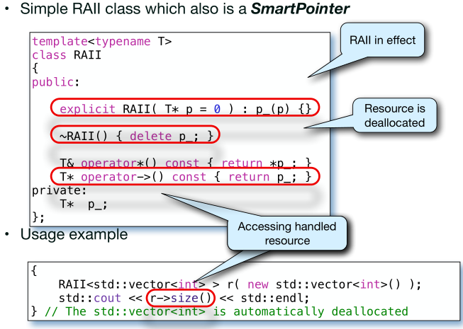

### **Christian Zhuang-Qing Nielsen, 201504624**
# **ISU 6: Resource Handling:**
- [**ISU 6: Resource Handling:**](#isu-6-resource-handling)
    - [**RAII - hvad og hvorfor?**](#raii---hvad-og-hvorfor)
    - [**Copy construction and the assignment operator**](#copy-construction-and-the-assignment-operator)
        - [**Rule of Three**](#rule-of-three)
    - [**Hvad er konceptet med en Counted SmartPointer?**](#hvad-er-konceptet-med-en-counted-smartpointer)
    - [**Hvad er boost::shared_ptr<> og hvordan bruges det?**](#hvad-er-boostshared_ptr-og-hvordan-bruges-det)
        - [**Weak pointers**](#weak-pointers)
---
Pointen med resource handling er at system der mere eller mindre automatisk holder styr på brugen af ressourcer under en proces. F.eks. kan man tale om garbage collection, således at en ressource bliver frigivet når den ikke bliver brugt af nogen parter længere. Udfordringen er her at det skal være _thread-safe_. Bemærk at ressourcen **IKKE** er `protected` selvom dens destruktion skal være dette.

Eksempel: <br>
1. Allokér ressourcer i Tråd A.
2. Passér ressourcen til tråd B, samtidig med at den bliver beholdt i A.
3. Frigiv brugen af ressourcen i tråd B og derefter i A.
4. Ressourcen er herefter frigivet.

Ovenstående trin er noget vi ønsker i vores Message Queues.
## **RAII - hvad og hvorfor?**
RAII (Resource Acquisition Is Initialization) er et idiom der hjælper med at administrere systemets ressourcer. Dette gøres ved at forbinde alle ressourcer (f.eks. mutex, queues, osv) i deres eget objekt, som selv håndterer deres livstid og memory. F.eks. har den en delete metode i destructoren som deallokerer memory for alle variablerne (til når de ikke længere bliver brugt).

Eksempel af brug:



## **Copy construction and the assignment operator**
Copy constructor bruges når man laver et nyt objekt ud fra et allerede eksisterende objekt. Assign bruges til ændre værdien af et objekt til et andet. Eksempler på kopiering og assignment kan ses i kodeboksen nedenunder.
```cpp
class Cat {
    public:
    Cat(){} // Constructor
}
int main(){
    Cat a();  // Construct cat-objekt
    Cat b(a); // Kopier Cat-objekt a
    Cat b = a; // Assign kopien b til at være lig a.
}
```
Selvom vi ikke eksplicit har defineret hvad copy- og assign-operatorne skal gøre, så fungerer de allerede i dette tilfælde. Dette er fordi de er implicit defineret for os. Vi kan dog alligevel overwrite dem til at have en anden funktionalitet hvis vi vil. 

Når ens klasse håndterer ressourcer kan man komme ud for, at kopier af et objekt påvirker det gamle hvis man bruger default copy implementationen, det er derfor vigtigt at explicit med hvad man gerne vil have at ens copy constructor og assignment operator rent faktisk skal gøre. Dette har ført til det såkaldte "Rule of Three".

### **Rule of Three**
_Hvis man bliver nødt til eksplicit at definere en af de følgende ting:_
- Destructor
- Copy constructor
- Copy assignment operator

_Så skal man højst sandsynligt definere alle tre eksplicit._

Det den siger er, at hvis én af disse tre af en eller anden grund ikke virker korrekt, så er det højst sandsynligt at de andre heller ikke vil virke korrekt, og at man derfor bliver nødt til eksplicit and implementere dem.

## **Hvad er konceptet med en Counted SmartPointer?**
Man vil gerne have at SmartPointers kan rydde op efter sig selv, men det er svært at holde styr når variabler og pointers ikke længere bliver brugt, da det er dyrt (hukommelsesmæssigt) at kopiere med copy construction. Løsning til dette problem er at tilføje en såkaldt `reference count` til SmartPointeren. Denne reference counting holder styr på antallet af smart pointers der pejer på det samme objekt. 

Når man benytter sig af copy constructor eller copy assignment operator, så bliver reference counteren tællet én op. Når man sletter en smartpointer bliver reference counteren tællet én ned.
Når antallet af pointers når 0, så sletter man objektet fordi det ikke længere bliver brugt (da ingen pejer på dette). 


## **Hvad er boost::shared_ptr<> og hvordan bruges det?**
shared_ptr er en del af boost-biblioteket. De sørger for effektiv garbage collection / memory management. Shared pointer er en smart pointer [dvs. et c++ objekt med overskrevet operator*() og operator->()], der holder en pointer til et objekt og en pointer til en shared reference count. 

Hver gang en kopi af smart pointeren bliver sabt (vha. copy constructoren), så inkrementeres reference counteren. Ligeledes bliver reference counteren dekrementeret hver gang en shared pointer bliver destrueret.

Reference counter starter på 1, og denne kan så inkrementeres og dekrementeres som beskrevet ovenfor. Når counteren når 0 bliver objektet destrueret, da det betyder at der ikke er flere tråde der bruger denne ressource/objekt. Dermed frigøres hukommelsen.

### **Weak pointers**
Kan kun bruges til at få en shared pointer til det samme objekt, og tjekke om objektet er blevet destrueret. Denne bruges til at bryde cyclic dependencies/references.