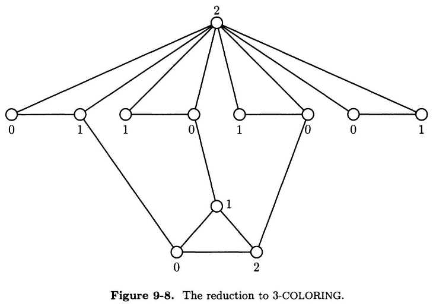
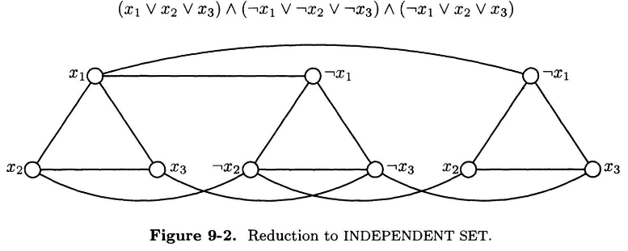
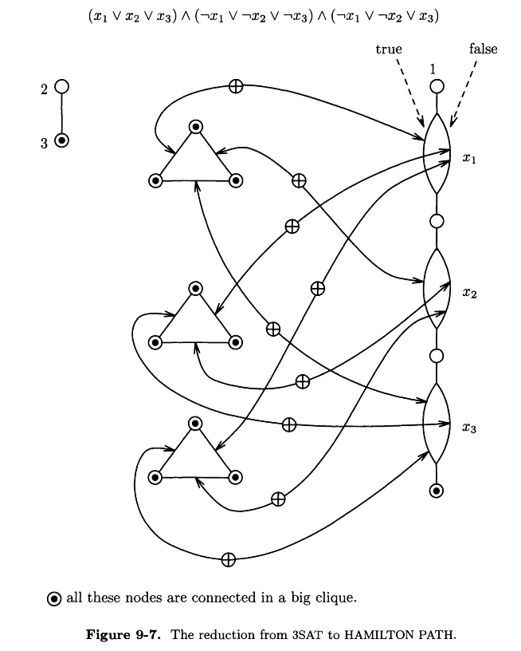

# dOpt Disposition 5 noter
---
- [dOpt Disposition 5 noter](#dopt-disposition-5-noter)
- [**SAT-relaterede søgninger**](#sat-relaterede-søgninger)
    - [**kSAT**](#ksat)
        - [**3SAT**](#3sat)
        - [**2SAT**](#2sat)
    - [**MAX2SAT**](#max2sat)
    - [**NAESAT**](#naesat)
- [**Graf-teoretiske problemer**](#graf-teoretiske-problemer)
    - [**3-Colouring**](#3-colouring)
    - [**MAX CUT**](#max-cut)
    - [**INDEPENDENT SET**](#independent-set)
        - [**CLIQUE** er **NP**-complete](#clique-er-np-complete)
        - [**NODE COVER** er **NP**-complete](#node-cover-er-np-complete)
    - [**HAMILTON PATH**](#hamilton-path)
        - [**Travelling Salesman Problem (TSP)**](#travelling-salesman-problem-tsp)
- [**Mængder og Tal Søgninger**](#mængder-og-tal-søgninger)
    - [**TRIPARTITE MATCHING**](#tripartite-matching)
        - [**SET COVERING**](#set-covering)
        - [**SET PACKING**](#set-packing)
        - [**EXACT COVER BY 3-SETS**](#exact-cover-by-3-sets)
        - [**Generaliseringer**](#generaliseringer)
    - [**Knapsack Problem**](#knapsack-problem)
    - [**Bin-packing**](#bin-packing)
- [**Strongly NP-complete**](#strongly-np-complete)
- [Slutnoter:](#slutnoter)
---
# **SAT-relaterede søgninger**
## **kSAT**
kSAT er SAT-algoritmen, men hvor $k$ er lig antallet af **literals** i hver **clause** i formlen når denne er på CNF (Conjunctive normal form)

### **3SAT**
3SAT er $NP$-complete. Bygger videre på beviset om at SAT er NP-complete.

**Bevis:** I tilfælde hvor clauses kun består af 1 eller 2 literals, så kan man bare duplikere literalen 1 eller 2 gange, til man opnår det ønskede 3 literals pr. clause. Denne duplikation er egenlig bare en reduktion fra SAT. Man kan se i Cook's theorem hvordan metoden er, da beviset stort set er det samme i begge tilfælde. 

Vi vil altså vise $SAT \leq 3SAT$. Man kan altid lave flere end 3 literals pr clause om til 3 literals pr clause, ved at introducere flere clauses.

**Bevis for at 3SAT stadig er $NP$-complete med restriktioner:**  
Kan vi være sikre på, at 3SAT stadig er NP-complete hvis vi fjerner muligheden for at kunne bruge den samme variabel og literal uendeligt mange gange? Hvad hvis vi sætter en restriktion på at hver variabel kun må bruges 3 gange, og hver literal kun må bruges 2 gange i hver formel?

Ovenstående restriktioner løser vi ved at introducere nye variabler. F.eks. hvis $x$ bliver brugt 5 gange, så erstatter vi første brug af x med $x_1$, andet brug med $x_2$ osv. op til $x_5$. 
- Vi skal bare være sikre på, at disse nye variabler ikke ændrer på vores original output (truth-value), derfor tilføjer vi til sidst en række clauses. For $x$-eksemplet ser det sådan ud:

$$ (\neg x_1 \lor x_2) \land (\neg x_2 \lor x_3) \land ... \land (\neg x_k \lor x_1) $$

- Bemærk at dette ikke bibeholder vores krav for 3SAT om, at hver clause skal have præcis 3 literals i hver.

### **2SAT**
Hvis vi lader $\phi$ være en instans af 2SAT. Så kan vi lave en graf $G(\phi)$, hvor verticerne i $G$ er variablerne af $\phi$ samt deres negeringer. Der vil da være en kant $(\alpha, \beta)$ i $G$, hvis og kun hvis der er en **clause** $(\neg \alpha \lor \beta)$ (hhv. $(\beta \lor \neg \alpha)$) i $\phi$.

**Teorem 9.1:** *$\phi$ er **unsatisfiable** hvis og kun hvis der er en variabel $x$, således at der er en **path** fra $x$ til $\neg x$ og fra $\neg x$ til $x$ i $G(\phi)$*

**Bevis:**  
Hvis vi antager at sådanne paths eksisterer, så må der være en **truth assignment** $T$, som tilfredsstiller $\phi$. Siden der er en path fra $x$ til $\neg x$ og at $T(x)=true$, samt T($\neg x)=false$, så må der nødvendigvis eksistere en kant $(\alpha, \beta)$, hvor $T(\alpha)=true$ og $T(\beta)=false$. 
 
Eftersom $(\alpha, \beta)$ er en kant i grafen $G(\phi)$, så må der nødvendigvis være en clause $(\neg \alpha \lor \beta)$ i $\phi$, men dette tilfredsstiller **ikke** $T$, da den først indgang skulle give **true** og den anden **false** ifølge vores antagelser om paths og resultatet om $T(x)$ og $T(\neg x)$.

Se resten af beviset i Papadimitriou teorem 9.1.

**Korollar: 2SAT er i $P$:**

**Bevis:** Eftersom $P$ er lukket under komplement, så bliver vi nødt til at vise at vi kan **genkende** *utilfredsstillende* udtryk i $P$. 

Bedre bevis: Da vi kun har 2 literals pr. clause, så kan vi bygge en graf ud fra de forskellige clauses. Dette gøres ved at hver variabel bliver til en vertex og en clause svarer til en kant (bue) mellem to verticer. Da en graf kan bygges i konstant tid og det kun tager $O(|C|^2) at tjekke stierne, så kan det hele gøres i polynomisk tid, hvilket betyder at 2SAT er en del af $P$.

**Bemærk**: Den eneste grund til at vi kan tegne en graf ud fra 2SAT er at der er præcis 2 literals i hver clause. Hvis der var 3 kunne vi ikke længere lave problemet om til en graf, og vores intuition ville derfor ikke længere gælde.

## **MAX2SAT**
En generalisering af 2SAT. Her er der en ekstra variabel $K$, som er det mål man prøver at nå. I dette tilfælde tilfredsstilles MAX2SAT hvis og kun hvis der findes en løsning bestående af præcis $K$ **antal clauses**.

**Teorem 9.2:** *MAX2SAT er $NP$-complete*.

**Bevis:** Konstruér ny MAX2SAT $R(\phi)$ ud fra en givet 3SAT $\phi$ med $m$ clauses. For hver clause $C_i = (\alpha \lor \beta \lor \gamma)$ i $\phi$ tilføjer vi 10 nye clauses til $R(\phi)$ på nedenstående form:

$(x)(y)(z)(w)$  
$(\neg x \lor \neg y)(\neg y \lor \neg z)(\neg z \lor \neg x)$  
$(x \lor \neg w)(y \lor \neg w)(z \lor \neg w)$  

Hvor vi erstatter $\alpha$, $\beta$ og $\gamma$ med $x$, $y$ og $z$. $w$ erstattes af en ny variable $w_i$, som er specifik til $C_i$.

Den nye instans af MAX2SAT $R(\phi)$ har tydeligvis 10 gange så mange clauses som $\phi$. Vi kan på et givent tidspunkt altid tilfredsstille 7 af de 10 clauses ovenfor ved at sætte enten $x$, $y$ eller $z$ til at være $TRUE$.  
Hvis vi så sætter vores mål $K=7m$, så kan vi opnå det mål (tilfredsstille $R(\phi)$ præcis de gange hvor $\phi$ også bliver tilfredsstillet. 

Dette er en reduktion fra 3SAT til MAX2SAT. Da vi ved at 3SAT er $NP$-complete, så ved vi også nu at MAX2SAT er $NP$-complete.

## **NAESAT**
Står for **"not-all-equal-SAT"** og fungerer næsten ligesom 3SAT. Forskellen er, at for hver clause, så må de tre literals ikke alle tre være sande. Ud over dette har vi stadig kravet at alle clauses skal være tilfredsstillet for at hele algoritmen retunerer true.

**Theorem 9.3:** **NAESAT** er $\bm{NP}$-complete.

**Bevis:**
- Er basically bare en reduktion fra CIRCUIT SAT til SAT med nogle ændringer.
- For at **NAESAT** skal kunne være **satisfiable** skal det originalle kredsløb også være satisfiable.

**Fremgangsmåde:**
- Til alle clauses (i CIRCUITSAT) med kun 1 eller 2 literals, tilføjer den samme literal som ekstra. Vi kalder denne for $z$.
- Antag der er en løsning (truth statement) $T$, som tilfredsstiller alle clauses i **NAESAT**. Så må komplementet $\overline{T}$ nødvendigvis **også tilfredsstille** **NAESAT**.
- I en af løsningerne tager $z$ værdien **false**. Det betyder at alle de **originale clauses** vil være tilfredsstilt gennem, hvilket er en reduktion CircuitSAT til NAESAT.
- Så kan vi se her, at hvis nu alle literals i den originale clause var true, så kunne vi bare sætte vores $z$ til at være false i vores **NAESAT**-clause.
- For at løse problemet med det omvendte tilfælde kan vi indføre $T(z)=false$, hvilket tilfredsstiller NAESAT og betyder at vi ikke har tilfælde hvor alle 3 literals er false (når z også er).
- Vi har nu dækket alle cases, og har vist at der er en gyldig reduktion fra SAT til NAESAT, hvilket gør den $NP$-complete.

# **Graf-teoretiske problemer**
## **3-Colouring**
Er et specialiseret k-colouring problem. Her forsøger man at farve en graf i $k$ (i dette tilfælde 3) forskellige farver, således at to verticer med éns farver ikke ligger lige ved siden af hinanden (I den forstand at de er **direkte forbundet**).

**Theorem 9.8:** 3-COLOURING er **NP**-complete.

**Bevis:** En simpel reduktion fra NAESAT. Vi er givet en mængde clauses $C_1,...C_m$, hver med 3 literals ud fra mængden af variabler $x_1,...x_m$. Spørgsmålet er så: Findes der en løsning med variablerne, således at **ingen clause** kun består af **true** eller **false** literals?

- Vi starter med at konstruere en graf $G$.
- Vi siger at grafen kan farves med tallene $\{0,1,2\}$, hvis og kun hvis all clauses tager forskellige værdier.
- Vi bruger "trekanter" i grafen til at tvinge os til at bruge alle tre farver (da vi lavver 3-colouring).
- Hver variabel $x_i$ vil da være en "trekant" $[a, x_i, \neg x_i]$, hvor $a$ er en fælles vertex som alle variabler er forbundet til. F.eks. en vertex med værdien $2$.
- Hver clause er også repræsenteret med en trekant $[C_{i1}, C_{i2}, C_{i3}]$. Her er der en kant, som forbinder $C_{ij}$ med den vertex som repræsenterer den $j$'de literal af $C_i$.

Vi påstår, at $G$ kan farves med farverne $\{0,1,2\}$ **hvis og kun hvis** den givne instans af NAESAT er tilfredsstillende (har en løsning). Hvis vi antager at grafen rent faktisk er 3-COLOURABLE:

- Vi kan antage (ved f.eks. at skifte navnene på farverne), at $a$ påtager sig farve $2$. Så må de der for hver $i$ være én af verticerne $x_i$ der bliver farvet $1$, og den tilsvarende anden vertex $\neg x_i$ blive farvet $0$.
- Hvis $x_i$ bliver farvet $1$, siger vi den har værdien **TRUE**, ellers er den **FALSE**.
- Hvis vi har en clause hvor alle tre literals har samme sandhedsværdi **TRUE**, så kan vi ikke farve trekanten da farve $1$ ikke kan benyttes.
- Tilsvarende hvis alle literals er **FALSE** kan vi ikke bruge $0$. (Dette fuldender beviset i "den ene retning")

For at bevise "den anden retning", så antager vi, at en tilfredsstillende løsning eksisterer:
- Vi farver vertex $a$ med $2$ som vi plejer.
- Vi farver resten af "variabeltrekanten" (dvs. alle de trekanter som er forbundet til top-level vertex med værdi $2$) ift. hvordan truth assignment løsningen ser ud. (True = 1, false = 0).
- For enhver clause kan vi farve clause-trekanten således:
    - Vi vælger 2 literals med modsatte sandhedsværdier (1 og 0). Disse eksisterer da clausen er tilfredsstillet. 
        - Vi farver deres tilsvarende verticer med de resterende farver fra mængden $\{0,1\}$. Vi farver **0 hvis literal er true, og 1 hvis literal er false**.
    - Den resterende literal farver vi den tilsvarende vertex med farven $2$.

Dette har givet os en reduktion fra NAESAT til 3-COLORING.

## **MAX CUT**
Givet en uorienteret graf $G$ med nonnegative kant-kapacitet, samt et target $K$, afgør om der eksisterer et snit i $G$ med en kapacitet på mindst $K$. Der eksisterer en polynomisk-tid løsning til MIN CUT, men ikke til MAX CUT.

**Theorem 9.5:** MAX CUT er **NP**-complete.

Vi reducerer fra NAESAT til MAX CUT.

1. Givet en NAESAT $\phi$, konstruér en ækvivalent MAX CUIT graf $G = (V,E)$ med goal $K$. 
2. For hver variabel $x_i$ i $\phi$ tilføjer vi 2 nye verticer til $G$. Disse verticer er hhv. $x_i$ og $\neg x_i$. Disse 2 verticer forbindes med en kant.
3. For hver clause $C$ i $\phi$ tilføjer vi en "clause trekant" mellem verticerne der svarer til literalerne i $C$.
 
Vi påstår at $G$ indeholder et cut/snit med kapacitet på mindst $n \cdot 2m$, hvis og kun hvis $\phi$ er tilfredsstillelig (dvs. har en løsning).  
Antag at $\phi$ har en løsning og betragt enhver tilfredsstillende truth assignment. Denne truth assignment svarer da til et snit i $G$.

4. De ene side af snittet vil udelukkende have verticer der evaluerer til $1$ i assignment, mens den anden side udelukkende evaluerer til $0$.
5. Efter som præcis ét af literals $x_i$ og $\neg x_i$ evaluerer til $1$ i assignment, så vil alle variabel-kanterne gå hen over snittet, hvilket kontributerer $n$ til snittets kapacitet.
6. Eftersom assignmenten tilfredsstiller $\phi$, så vil præcis 2 af kanterne i hver clause-trekant gå hen over snittet, hvilket kontributerer $2m$ til snittets kapacitet.
7. Dette giver snittet en kapacitet på $n + 2m$.
8. Eftersom trekanterne højst kan kontributere $2$ til kapaciteten hver, så bliver vi nødt til at sørge for at alle clause-trekanterne bliver skåret over af snittet.
9. Dette betyder dog også at **mindst 1** af literals i trekanten er **FALSE**, og mindst 1 er **TRUE**.
10. Ovenstående tilfredsstiller kravet om, at alle literals in en clause (og derfor all verticer i en trekant) ikke kan have den samme sandhedsværdi.

Og på den måde har vi reduceret fra NAESAT til MAX CUT.

## **INDEPENDENT SET**
Givet en graf $G$ og et mål $K$, findes der en uafhængig mængde $I$, hvor størrelsen af denne  er $|I|=K?$ Med uafhængigt sæt menes der verticer i grafen som ikke er direkte forbundet af en kant.

**Bevis:** Hardness: 3SAT $\leq$ INDEPENDENT SET.

Igen bruges den simple gadget - trekanten. Pointen er denne gang at hvis grafen indeholder en trekant, så kan der højst være én vertex fra denne trekant som kan være med i $I$ (da de er indbyrdes forbundet). Denne gang vil vi **begrænse** klassen af grafen vi betragter. Dette gør problemet nemmere, men uden at **sænke problemets kompleksitet**.

Vi betragter en graf, hvor verticerne kan blive partitioneret til $m$ disjunkte (adskilte) trekanter:

- Her er det indlysende, at vores independent set $I$ **kun kan indeholde højst $m$ verticer**, da vi højst kan tage én vertex fra hver trekant. Denne uafhængige mængde af størrelse $m$ eksisterer **kun** hvis forbindelserne mellem trekanterne er sådan at de tillader os at "tage" en vertex fra hver trekant.
- Det er tydeligt at vi kan gå videre med beviset ved **at reducere fra 3SAT til INDEPENDENT SET**.
1. For alle $m$ clauses i det givne CNF fra 3SAT $\phi$, skaber vi en **ny trekant** i $G$. 
2. Hver vertex i trekanten vil da svare til en literal fra clausen.
3. Vi tilføjer en kant mellem to verticer i **2 forskellige trekanter** HVIS OG KUN HVIS at de to verticer er **hinandens modsatte literals** (dvs. den ene er en negering af den anden: $x_i$ og $\neg x_i$).

På den måde er påstår vi at der findes et **Independent set $I$** hvis og kun hvis vores 3SAT har en løsning. Da hver literal har en node, og vi har lavet forbindelser mellem enhver variabel og dens negering, så vil der ikke eksistere både en variabel OG dens negering i $I$. Fordi $I$ har en vertex fra alle trekanter, så vil **truth assignment** tilfredsstille alle clauses.

Ved så aktivt at vælge literals der er **TRUE** i hver clause, og vælge netop denne node i trekanten for alle trekanter, så vil vi opnå præcis $m=K$ uafhængige verticer, som er en løsning for både 3SAT og INDEPENDENT SET. Vi har altså reduceret fra 3SAT $\leq$ INDEPENDENT SET.

### **CLIQUE** er **NP**-complete
CLIQUE er en mængde af verticer, hvor der er alle mulige kanter imellem disse.

CLIQUE er komplementet af INDEPENDENT SET, da den består præcis af de kanter der er forbundet med hinanden. Omvendt, hvis vi tager komplementet af en CLIQUE-mængde, så får vi da en uafhængig mængde af verticer tilbage (altså en INDEPENDENT SET). CLIQUE er da en omformulering af INDEPENDANT SET, og må derfor også være **NP**-complete

### **NODE COVER** er **NP**-complete
Node Cover (Vertex Cover) er en mængde af verticer, hvorfra man kan "se" alle andre verticer. I dette tilfælde betyder "se" at node cover mængde til sammen er direkte forbundet til alle andre verticer med deres kanter.

INDEPENDENT SET $I$ er en uafhængig mængde af $G = (V,E)$, hvis og kun hvis $V-I$ er et **node cover** af samme graf. Derfor er Node Cover bare en omformulering af INDEPENDENT SET, og må derfor være **NP**-complete.

## **HAMILTON PATH**
En Hamilton path er en path igennem en graf, som er gyldig hvis og kun hvis den går igennem alle verticer i grafen præcis én gang. Beviset laves ved at reducere fra 3SAT til Hamilton path: **3SAT** $\leq$ **HAMILTON PATH**.

Vi er givet en 3CNF (conjunctive normal form) formel $\phi$ med variablerne $x_1,...,x_n$ og clauserne $C_1,...C_m$. Hver clause har altså 3 literals. Idéen er så at konstruere en graf $R(\phi)$, der har en **Hamilton path**, hvis og kun hvis formlen er tilfredsstillende (en løsning) til 3SAT'en.

Vi bruger en række forskellige gadgets:
- **Choice:** Denne gadget beskriver valget mellem de to værdier TRUE og FALSE. Her kan den vælge enten den venstre eller højre parallelle kant, afhængig af sandhedsværdien den ser på den givne variabel.
- **Consistency:** Denne gadget sikrer, at hvis man starter på et givent punkt, så vil man altid ende i det samme punkt et andet sted. Dette er vigtigt fordi man ikke nødvendigvis altid starter i det samme punkt, og ruterne skal derfor ses som to forskellige kanter.   Man kan se de forskellige ruter som to ellers uafhængige grafer, som er forbundet af en **exclusive or** gate.
- **Constraint:** Til at afbillede clauses fra 3SAT, så bruger vi igen trekanter. Forskellen er denne gang, at i stedet for at hver vertex i trekanten betegner en literal, så er det i stedet for hver kant (edge, dvs. side) af trekanten som er en literal.   Ruten bevæger sig så igennem denne kant (edge), hvis den tilsvarende literal er **false**. Det er åbenlyst at mindst én af literals skal være **TRUE**, til dels for at tilfredsstille 3SAT, men også så man ikke kommer tilbage til den samme vertex i trekanten.

Vi kan nu lægge det hele sammen i én stor graf $G$:

1. $G$ vil have $n$ kopier af **choice**-gadget, én for hver variabel, som er forbundet i serie. Den vil også have $m$ trekanter, én for hver clause, hvor hver kant (edge) i trekanten svarer til en literal fra clausen.
2. Hvis en side (edge) i trekanten svarer til en literal $x_i$, så er den forbundet med en **"exclusive-or"** gadget, hvor **TRUE**-siden af choice subgraf svarer til $x_i$. Dette betyder at denne **TRUE**-rute i choice gadget bliver gennemgået hvis den tilsvarende trekant-edge **ikke gør**. Tilsvarende er $\neg x_i$ forbundet til **FALSE**-siden
3. Til sidst tager vi alle $3m$ verticer i trekanterne + den sidste node i choice-gadget kæden + en ny node $3$ og forbinder dem med alle mulige kanter. Dette giver os en stor **clique** (subgraf hvor alle mulige kanter er forbundet).
4. Vi forbinder en enkelt vertex $2$ sammen med vertex $3$. Dette fuldender konstruktionen af grafen $R(\phi)$.

Grafen kan ses i billedet herunder:

Vi påstår at grafen har en Hamilton path hvis og kun hvis $\phi$ (Fra 3SAT) har en tilfredsstillende truth assignment. Hvis vi antager at sådan Hamilton path eksisterer, så må:

- De to ender af path'en må nødvendigvis være de to verticer af "degree one", som hhv. er $1$ og $2$. Dette gør at vi kan antage at path'en starter på vertex $1$.
- Efter dette gennemgår vi præcis én af de to parallelruter i **choice**-gadgeten for den første variabel.
- Alle **exclusive-or** ruter fra dette choice må nødvendigvis gennemgås. Efter dette går vi videre.
- Vi forsætter indtil hele **choice**-kæden er gennemgået. Denne del af Hamilton path definerer en **truth assignment** $T$.
- Efter dette vil path'en forsætte og gennemgå alle trekanterne i en eller anden rækkefølge, og vi ender med at være på **vertex** $2$.

Vi påstår her, at $T$ tilfredsstiller $\phi$. Da alle **exclusive-or** gadgets bliver gennemgået, så opfører de sig netop som exclusive-or's der forbinder ellers uafhængige kanter. Så siderne i trekanten bliver kun gennemgået hvis de tilsvarende literals er **false**, og eftersom ingen clauses har 3 **false** literals, så er $\phi$ tilfredsstillet.

Omvendt, hvis vi er givet en truth assignment $T$, så kan vi fremvise en Hamilton path af $R(\phi)$:
1. Hamilton path ruten starter på vertex $1$.
2. Den går i gennem kæden af choices (gadgets'ne), hvor den for hver variabel vælger den kant der svarer til variablens sandhedsværdi ift. $T$.
3. Når dette er gjort, så vil resten af grafen være en kæmpe **CLIQUE**, med nogle vertex-adskilte ruter af længde 2 eller mindre. Disse skal også gennemgås.
4. Eftersom alle mulige kanter er til stede (det er en clique), så er det nemt at sammensætte disse ruter, og dermed fuldføre Hamilton-ruten, således at den slutter på verticer $3$ og $2$.

### **Travelling Salesman Problem (TSP)**
Denne minder meget om HAMILTON PATH. Derfor kan vi bruge beviset for denne til at vise TSP.

**Korollar:** **TSP (D)** er **NP**-complete. 

**Bevis:** 

Vi reducerer fra HAMILTON PATH til TSP. Givet en graf $G$ med $n$ verticer, så designer vi en **distance-matrix** $d_{ij}$ og et **budget** $B$, således at der findes en TSP-tur af længde $B$ (eller mindre) hvis og kun hvis $G$ har en **Hamilton path**.

Hver by bliver til en vvertex på grafen. Afstanden mellem to byer $i$ og $j$ er $1$, hvis der findes en kant $[i,j] \in G$, og $2$ hvis der ikke gør. Til sidst: $B=n+1$.

%%% IKKE BEVIST %%%

# **Mængder og Tal Søgninger**

## **TRIPARTITE MATCHING**
Tripartite matching er tredimensionel matching. Her har vi præcis tre mængder hver med $n$ elementer, og så prøver vi at finde en såkalt **ternary relation** $T \subseteq B \times G \times H$. Målet er at finde en mængde af $n$ tripletter i $T$, hvoraf ingen af dem må have en element i fællesskab. I tilfælder hvor $B$ er drenge, $G$ er piger og $H$ er hjem, så skal hver dreng matches til en forskellig pige, og disse par skal have hvert sit hjem.

**Bevis:** 3SAT $\leq$ TRIPARTITE MATCHING

Vores gadget er i dette tilfælde en **combined gadget**, der dækker over både **choice** og **consistency**.

%%% IKKE BEVIST %%%

### **SET COVERING**
Vi har en familie af delmængder $F = \{S_1,...S_n\}$. Disse er delmængder af en endelig mængde $U$. Vi er også givet et budget $B$, som er vores mål.

Det gælder så om at finde en mængde af $B$ mængder i $F$, hvis forening (UNION) er præcis $U$.

### **SET PACKING**
Igen er vi givet en familie af delmængder $F = \{S_1,...S_n\}$ af $U$ og et mål $K$. Her er spørgsmålet om der eksisterer $K$-parvist disjunkte mængder i familien.

### **EXACT COVER BY 3-SETS**
Minder en del om Set covering, ud over at vi givet en familie $F = \{S_1,...S_n\}$ som er delmængder af $U$, således at $|U| = 3m$ for et heltal $m$ og $|S_i|=3$ for alle $i$.

Findes der så $m$ mængder i $F$, som er disjunkte og har $U$ som deres forening (UNION)?

### **Generaliseringer**
De kommende tre algoritmer er alle genereliseringer af Tripartite Matching. De er derfor **NP**-komplette. Det er især tydeligt at Tripartite matching er en special case af Exact Cover by 3-sets, hvor **U** partitioneres til tre ens mængder $B$, $G$ og $H$, således at hver mængde i $F$ indeholder præcist ét element fra hver.

Det er også tydeligt at Exact Cover by 3-sets er specialtilfældet af SET COVERING, hvor universet har $3m$ elementer, alle mængder i $F$ har 3 elementer, og hvor budgettet er $m$. Ligeleds for SET PACKING.

## **Knapsack Problem**
Givet vægte $w_1,...w_n$, værdier $v_1,...v_n$, et vægt-budget $B$ og et mål $K$, eksisterer der en mængde af genstande $S=\{1,..n\}$, hvor den samlede vægt af tingene er højst lige så stor som budgettet: $\sum_{i \in S} w_i \leq B$, og hvor den samlede værdi af tingene er mindst lige så lille som målet: $\sum_{i \in S} v_i \geq K$?

Hardness: ECB3S (Exact cover by 3-sets) $\leq$ KNAPSACK

%%% BEVIS IKKE VIST %%%

## **Bin-packing**
Givet $n$ positive heltal $a_1,...a_n$ (ting), Et positivt heltal $B$ (antallet af spande), samt et positivt heltal $C$ (størrelse af en spand), **er det muligt at placere alle tingene i spandene,** således de **præcist er fyldt op?**

Bevis udføres ved at reducere TRIPARTITE MATCHING til BIN PACKING med alle heltal i ouputtet med tiden $O(n^4)$. 

Den er stronly NP-hard.

# **Strongly NP-complete**
Kan aldrig løses i polynomisk tid, ligegyldigt inputtet. F.eks. kan Knapsack løses i polynomisk tid, hvis den har et unary input. Dette betyder at den ikke er strongly np-complete. Dette kan gøres fordi den har en **pesudopolynomial algoritme**.

En algoritme kører i pseudo-polynomisk tid, hvis dens kørselstid er baseret på den **numeriske størrelse af inputtet** (dvs. at meget store tal kører langsommere), og ikke i længden af inputtet (f.eks. hvor stor en mængde data man har).

# Slutnoter:
Man skal ikke bruge kendskaben om NP-completeness og NP-hardness til at opgive med at løse algoritmiske problemer. F.eks. selvom TSP har input på 150 byer, kan den stadig hurtigt løses vha. Branch-and-cut, også selvom det er et NP-complete problem. Det eneste vi ved om TSP er, at der ikke findes en polynomisk-tid løsning, men det betyder ikke at de løsninger der findes er forfærdeligt langsomme.

